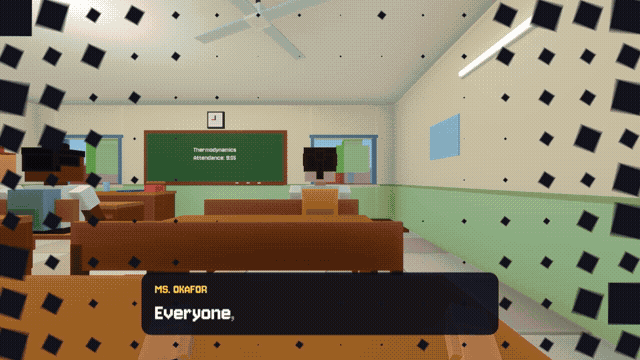

# Bunk Master

**[Watch the 30 s trailer (MP4)](media/BunkMaster-trailer.mp4)** · [Download the latest release](https://github.com/KillCobra/BunkMaster/releases/latest)

Multiplayer first-person college bunk simulator (Godot 4.4, Windows and Mac). You're a student at the Royal
Academy of Unnecessary Sciences. Sneak out of class with your friends, whisper over proximity voice chat while
the teacher can hear you, talk your way out when you're caught, knock the staff over with a trolley, blame a
friend, and escape before the final bell. Make a plan, someone ruins it, improvise, panic, barely get out.

## Play (no install)
Download the latest release: `BunkMaster.zip` (Windows: extract it, keep the `.dll` next to `BunkMaster.exe`) or
`BunkMaster-mac.zip`. Everyone plays through online sessions (below); you can join a round already in progress,
and rejoin after a drop (your quests and score are kept).

## Mac
`export/BunkMaster-mac.zip` holds `Bunk Master.app` (universal: Intel + Apple Silicon, macOS 11+).
It's ad-hoc signed, not notarized, so the first launch needs one extra step:
unzip, move it to Applications, then **right-click > Open > Open**. If macOS says the app is "damaged",
run once in Terminal: `xattr -cr "/Applications/Bunk Master.app"`. Mac and Windows players can play together
(same version of the game on both).

## Online sessions (no accounts)
1. Host: **CREATE SESSION** -> pick a session name (and an optional password) -> you're in the lobby.
2. Friends (up to 7): **JOIN SESSION** -> type the same name (and password) -> they connect and appear in the lobby.
3. In the lobby everyone can change their name (it's what the others see all game) and classroom. Newcomers are
   **NOT READY**; each friend clicks **I'M READY**, and the host's **START CLASS** unlocks once everyone is ready.

How it works: the host announces the session on free public MQTT brokers (EMQX/HiveMQ/Mosquitto, several at once
for redundancy); joiners find it there and swap WebRTC connection details, then play is direct peer-to-peer
(STUN finds the route). Passwords are only sent as a hash. Works on most home networks; if a pair of networks is
too strict (no connection after ~35 s, common on mobile data), the other person should create the session or one
side should switch networks. Manual invite codes remain as a fallback (link under the session form).

## Controls
WASD move · Shift sprint · Ctrl/C crouch · Space jump · E interact / pick up / hand a friend something
· Left-click: shove (staff or a friend; hold to charge a basketball shot) · 1-3 use items (1-4 pick an excuse)
· Q phone · V push to talk (if you picked push-to-talk) · B quick shout (no mic needed, then 1-4)
· H raise hand (ask a question) · G throw paper ball (distraction) · T ping · R answer attendance for a friend
· M big map (F: switch floor) · Tab scores · F12 screenshot · Esc menu · F10 leave

Your first round only shows the basics (move, crouch, jump, E, shove); the rest is explained the first time it's
useful, and the key line at the bottom grows with the rounds you've played.

## Voice chat (proximity)
Each player picks how they hear friends (Settings > VOICE): **everyone at full volume, anywhere** (the default,
like a party chat) or **proximity**: clear next to you, fading to nothing down the corridor, muffled through a
wall, a rumble through a floor. In the lobby everyone hears everyone. A phone call from an escaped friend always
comes through clearly (a call screen on both phones, hang up any time). The host can turn **Staff hear mics** OFF
in the lobby. **Staff hear how loud you are** (never what you
say): a whisper carries a metre or two, talking about 8 m, a yell down the corridor (half as far through walls,
never through floors). Talk in class and the teacher turns round from the board ("Who's talking?!"); talk
where you shouldn't be and staff come to look; talk in a locker and they know exactly where you are. The HUD
shows how far you can be heard right now.
Settings > VOICE: open mic / push-to-talk (V) / mic off, the microphone, the open-mic threshold (with a live
meter) and your friends' volume. Use headphones. No mic? B then 1-4 shouts "Psst!", "RUN!", "Over here!" or
"HELP!" (staff hear those too).

## Maps
The lobby offers **First Day** and **Grand Campus** (and Random between them): one small school to learn in and
one big campus to master. The other three maps below still build and play (`--map=2..4`), parked until those
two are as good as they can be. **First Day** is the small starter map: the original two-storey school in its
compound, escape to the chai stall across the road. Every other map has its **own, much bigger university building**
(many corridors, dozens of rooms, switchback stairwells, classrooms on upper floors) inside huge grounds
300-450 m across. Escaping means getting out of the building *and* past the university's outer walls. Green stars
on the big map (M, mouse wheel zoom, F to change floor) mark the ways out.
- **Grand Campus** - the *Old Quadrangle*: four 3-storey wings round a courtyard (court, fountain), joined on
  every floor so you can walk the whole ring without going downstairs. Outside:
  boulevards, hostels, a stadium, a hedge maze and a lake. Out through the guarded main gate, a fence hole
  (crouch), a storm drain (crouch) or the construction site's scaffolding over the south wall.
- **Whispering Pines** - *Pinewood Lodges*: two long 2-storey timber lodges joined by a Great Hall (an H) in a
  forest split by a river. Cross by the ranger's bridge, a rope bridge or stepping stones (jump), then the north
  checkpoint, the logging gate (crouch), the fence a tree fell on (jump) or the creek culvert (crouch).
- **Lagoon Island** - the *Marine Institute*: a 3-storey white U closed by a back block round a pool courtyard.
  The 150 m bridge (toll guards, a bridge patrol), the ferry at the east pier, or hop the rocks to a fishing boat.
- **Downtown Campus** - *Quibble Towers*: two 6-storey towers either side of a courtyard, classes up to the
  5th floor. The north or west checkpoint, a torn fence in the back alley (crouch), or the metro.
- **Random**: one of the unlocked lobby maps, picked when class starts.

Fall in the water and it washes you back to the bank. Every map has its own guards, patrols and cameras;
in the big buildings the proctor and vice principal patrol the upper corridors.

## First Day's school
The main building has two floors. Ground: Class A, Class B, Computer Room, Seminar Hall. First floor:
Class C, Lab, Music Room, Store Room, along a balcony watched by the proctor and a CCTV camera. Ramped stairs
at both ends of the building start from the back. The minimap (bottom right) turns with you and shows your
floor, friends, pings, nearby staff and your quest targets; the big map (M) shows the whole campus. The floor
you're on is also shown faintly at the top of the screen (it lights up when you change floors).

## School day
- **Timetable:** the round is split into periods (2-6, by round length). Each class moves to a new room and
  subject every period; the bell gives you 25 s to walk to your next class (corridors are fair game then). The
  top-left card shows the period, subject, room and floor; a blue **YOUR SEAT** pin (and a pin on the maps) shows
  where to sit. There's **one attendance per class per period**.
- **Surprise tests:** once a period each room has a test. Sit in your seat: the teacher walks over and hands you
  the paper (walk in late and you get a muttered remark with it), you look it over, then the clock starts. Each
  subject has three kinds of paper, picked at random: Thermodynamics (reactor needle · vent the boilers · which is
  hotter?), Maths (quick sums · finish the pattern · which is bigger?), Data Structures (sort · stacks and queues ·
  binary search), Chemistry (repeat the recipe · element symbols · acid or base?). Up to +100 points, a missed test
  is -50. You get 8 s to sit down once it starts (5 s if you walk in late); after that a teacher who sees you on
  your feet sends you to detention. A photo of the exam paper (staff room) gets you full marks on your next test.
- **Raise your hand (H):** in your own class, pick a question: intelligent (the teacher likes you: less suspicion,
  calms down faster, Rs 5), quirky (the class laughs) or mischievous (the teacher rants at the board for a while,
  everyone's chance to sneak out, but 30% of the time they see through it: a strike).
- **Hall pass running out:** you get 40 s to walk back without being chased; arriving after it expired annoys your
  teacher (one strictness notch), but it's not detention. Walking into your classroom gives you a few seconds to
  reach your seat.
- **Class change:** the NPC students pack up, walk out and head to their next classroom too.
- **Pocket money:** coins lie around campus (Rs 5-15, walk over them; new ones turn up elsewhere). You also earn
  Rs 40 per side quest, up to Rs 20 per test and Rs 5 for answering attendance. Spend it at Pappu Uncle's canteen
  counter (E): Samosa Rs 10, Hall Pass Rs 40, Medical Note Rs 70, Signed passes (+15 s per hall pass this round,
  up to 3 levels), and Rs 40 of samosas "for the principal" that get a friend out of detention. Hand a friend an
  item or Rs 10 by looking at them and pressing E (contraband goes in THEIR bag: their problem if they're caught).
- **Phone (Q):** held in your right hand; the mouse taps its screen and you can still walk. One home screen answers
  what you need while sneaking: your class, room and floor, who teaches it and their quirk, attendance and test
  times, what you're doing (the current quest), your money and pockets, and where your friends are. Navigate
  shows the shortest way to your seat (SHOW ME THE WAY lights the route on the floor and your minimap for 10 s);
  Help Out is mission control once you've escaped (below).
- **Pings (T):** point at something and ping it: people are named (and the marker follows them), objects are
  named ("Fire alarm", "Locker", "Principal's car"...), anywhere else is a location ("Location: Near Canteen").
  Everyone in the session sees them.
- **Coins** turn up where money gets dropped or stashed: by the lockers and in the washrooms (worth more), under
  desks and canteen chairs, sometimes out in the open. A picked-up coin comes back somewhere else 20 s later.
- **Other students:** walk into one and they stumble out of your way with a word or two; you keep going.
- **Music room:** play the piano or drums (E, then keys 1-8). Everyone hears it, and so do the staff.
- **Washrooms:** use the toilet for a no-questions washroom break (-25 suspicion, 20 s to wander back), or hide an
  item in the cistern and fish it out later. Getting caught confiscates the canteen key, medical notes and hall passes.
- **Caught? Talk your way out.** Staff who grab you ask why you're out of class, and you get 4 s to pick an
  excuse (1-4): proof in your pocket works best (hall pass, medical note, library book); "washroom" works near a
  washroom, "Dr. Haddad sent me" works unless he's standing right there, "I'm lost" works on First Day. The same
  excuse twice never works on the same person, and staff compare notes. Or blame the nearest friend: you walk,
  they get chased ("YOU TOLD IYER I WAS IN THE WASHROOM?!"). A friend next to you can vouch for you (E). Shoving
  still works too. Every catch is announced over the PA, by name.
- **Detention:** starts small and grows with every catch in a round: 8 s, 15 s, 25 s, then 35 s (x0.5 on First
  Day, where the very first catch is only a warning; x1.2 on Downtown). The lines paper opens by itself: just type the
  sentence exactly and press Enter (5 s off each, only 3 s from the 4th catch on), then type the next one. A wrong line flashes red, the paper
  shakes and the line is wiped: try again. Shouting in detention adds 3 s. **Friends can get you out:** pull the
  fire alarm (the principal runs out, so do you), Pappu Uncle's samosa bribe (Rs 40), a paper ball through the
  office window (two lines done, -10 s), or a call to the office from an escaped friend (halves it). Afterwards
  you walk back to class yourself (60 s grace); your teacher scolds you and gets stricter (notices more, less
  wiggle room at your seat). Sit nicely for 45 s to calm them down a notch.

## The staff
Each teacher plays differently (the period card and phone say who's teaching and their quirk):
**Ms. Okafor** is hard to fool but soft on good marks (a 70+ average makes her slow to notice you);
**Mr. Tanaka** sees across the whole room but won't chase you past his corridor; **Dr. Alvarez** hears very
little and, asked a smart question (H), lectures at the board for 20 s: everyone's chance to leave;
**Mrs. Iyer** hears everything and believes one excuse from you, once. Aisha the prefect doesn't chase: she runs
to tell your teacher (shove her before she gets there). Mr. Mendes the caretaker mops as he patrols. Pappu Uncle
at the canteen has something to say about your wallet, your detentions and the mood of the school.

## Chaos
- **Knock people over.** Shove a friend (no penalty) and they fly and lie there a moment; two players sprinting
  into each other both go down; so does anyone hit by a hard basketball. Staff knocked over drop their books and
  take out whoever they land on.
- **Wet floors.** Mr. Mendes leaves wet patches; every washroom has a mop bucket to kick over (E). Sprint across
  one and you slip. So does a teacher chasing you.
- **Trolleys** on the assembly ground: push (E), let go at speed and it rolls on, flattening staff. A crouching
  friend can hop in and ride (Space to hop out).
- **Fire extinguishers** stand by every fire alarm: two sprays of smoke that blind staff and CCTV, knock over
  whoever's in front and leave slippery foam.
- **Samosas:** bribe staff up close, throw one at staff further off (they stop to eat), or splat a friend.
- **Pranks:** hold a friend's locker or stall shut for 3 s (E); a paper ball landing on a friend makes staff look.
- **Controls:** Settings → CONTROLS to rebind any key.
- **HUD size:** Settings → HUD SIZE: 1 Small, 2 Normal (default), 3 Large. The whole UI also scales with the window
  (it's laid out for 1280 x 880 and opens at 1440 x 990).

## How to bunk
- Stay near your seat while your teacher faces the class; move when they turn to the board.
- Outside your own classroom you're suspicious to all staff and CCTV. Suspicion fills while seen; at 100% they chase.
  Staff and cameras only see (and hear) students on their own floor: never through ceilings or across floors.
  Their **vision** shows as wedges on the minimap and big map (yellow calm, orange suspicious, red chasing); turn
  it off in Settings.
  CCTV, the librarian and the canteen uncle don't chase: they call someone who will.
- Sprinting is loud. Crouching hides you behind desks. Walking next to other students gives cover.
- Hide in lockers or washroom stalls (E) to break a chase, unless they saw you get in.
- Attendance once per period. Absent = +45 suspicion, unless a friend in class presses R when your name is called.
- When staff reach you they grab you for a moment: left-click to shove them over and run. Shoving costs
  score and adds 8 s to your next detention; 4 s cooldown.
- Caught = detention in the principal's office, however far you got (see School day).
- Basketball: pick up a ball on the court (E), aim at the hoop, hold left-click (~1 s for a mid-range shot), release.
- Ways out of First Day's school: main gate (guard's chai break, or show him a forged medical note), back
  classroom windows (crouch + jump), broken back wall (crates, or get a boost from a crouching friend: E), the
  service gate in the east wall (key behind the canteen counter). A medical note works on any gate guard.
- Items: Hall Pass (ask your teacher or buy one, 35 s of legal wandering), Samosa (bribe/distract staff or eat it),
  Medical Note (staff room cupboard), Canteen Key.
- Fire alarm (verandah pillars): staff evacuate to the plaza for 25 s. 150 s cooldown.
- Escaped? You're **mission control** (phone > Help Out): look through the CCTV cameras (staff are tracked while
  you watch; E next camera, Space back), make one fake announcement that pulls the staff to the canteen, the
  assembly ground or the staff room, open the service gate once, call a friend (their phone RINGS where staff can
  hear it; then you two can talk from anywhere for 40 s), call the office for a friend in detention, sit a
  friend's test on your phone and text them the answers, prank-call the staff chasing them, send money or a samosa,
  ring the bell at the gate, or watch a friend over their shoulder. Each help is +40 points. You can also throw
  paper balls back over the wall.
- Score: escape +500 plus time left, side quests +150 each, the whole chain +200, style points, caught -100,
  spotted -25. Round lengths: 5, 8 or 12 minutes.
- **The final bell: the class CCTV archive.** Up to six awards from what actually happened (Closest Call, Biggest
  Snitch, Most Wanted, Chaos Agent, Loudest, Smooth Talker, Academic Weapon, Guardian Angel, Most Betrayed, Stunt
  Double, Samosa Enthusiast, Worst Attendance, Detention Regular), then a replay of the round's best moment from a
  CCTV camera (a snitch, dominoes, a trolley hit, a slip, a catch...). F12 saves a screenshot.
- **The PA** reads out the academy's notices ("Students are reminded that fleeing through ventilation systems is
  not an approved extracurricular activity."), every heat level, and every catch by name.

## Progress, quests and challenges
- **Your profile** (saved on your PC): XP from every round, levels and ranks (Fresher, Backbencher, Proxy King,
  Canteen Legend, Bunk Master: each rank unlocks a name-tag colour), 3 stars per map (escape / all quests / escape
  without a detention) and your best escape time. The results screen shows the XP bar, new stars, records, what
  you unlocked and what to go for next.
- **Maps open in order:** escape First Day to open Grand Campus, and so on (or reach level 3, 6, 9, 12).
  "Random" only picks maps the host has opened.
- **Rs you have left at the final bell go in the bank.** Spend it in the lobby's character creator: locked (gold)
  items show their price (caps, shades, blazers, lab coats, gold / neon / fire name tags...).
- **Quest chain:** every round starts with the same opening quest (answer the register, then slip out of class),
  then a medium one (co-op ones with friends about: boost a friend, answer the register for a friend), then a risky
  one (the exam paper, the principal's car). Finish all three: +200 and 40 s to walk out through a gate.
- **Heat** rises through the round (and with every catch or fire alarm): 1 teachers only, 2 the prefect and
  caretaker start patrolling, 3 sharper CCTV plus the proctor and vice principal upstairs, 4 lockdown (no chai
  breaks, everyone jumpier). Shown under your suspicion meter.
- **Style:** CLOSE CALL (get out of sight after passing 80% suspicion), SILENT (25 m out of class unseen), SHOOK
  THEM OFF (lose a chaser), PROXY, QUEST: a pop-up and a few points each.
- **About to be spotted:** the screen edge glows towards whoever is watching and a blip speeds up.
- **Round events** (6 in 10 rounds): Surprise Inspection, Principal's Birthday (cake at the canteen halfway),
  Rain, Power Cut (no CCTV, dark corridors), Exam Week (tests sooner, double marks).
- **Daily challenge** (parked for now; dev: `--map=-2`): the same map, event and rule for everyone that day (no
  hall passes / start broke / escape under 3:00). Escape for +300 XP and Rs 100, once a day.
- **Your first round** (anyone in the lobby with 0 rounds, on First Day) has no surprise tests and no round
  event, and the school never gets stricter than heat 2.
- **Modes:** Class (everyone out = +50% for everyone) or Race (first one out wins +300 and ends the round; paper
  balls that land on a rival make the staff look at them).

## Develop
Open `project.godot` in Godot 4.4+. Test multiplayer with Debug > Customize Run Instances.
Art: everything is coloured boxes merged by `scripts/voxel.gd` (fake-bevel shader `shaders/voxel.gdshader`),
colours in `scripts/palette.gd`. Text uses the pixel font Jersey 10 (SIL OFL, `fonts/`; `fonts/make_font.py`
makes the 1.33x-size copy the game uses). Curved paths, roundabouts and rounded kerbs: `curve_walk` / `curve_road`
in `scenes/world/maps/grounds.gd`. Audio is synthesized at startup by `autoload/sfx.gd` (no asset files).
Rules and NPC brains: `scenes/world/director.gd`. Framework + First Day's school: `scenes/world/campus_builder.gd`.
Maps: `scenes/world/maps/` (list in `maps.gd`; outdoor toolkit `grounds.gd`; building toolkit `academic_kit.gd`
builds wings of corridors, rooms and stairwells from room lists).

Trailer: `videos/` is the Remotion project that makes `media/BunkMaster-trailer.mp4` (see `videos/README.md`; `npm install` there first). The README teaser `media/teaser.gif` is 12 s of it.

Build the exe: `godot --headless --path . --export-release "Windows Desktop" export/BunkMaster.exe`
(the preset uses the template in `export/templates/`; or install Godot's export templates and clear the custom path).

Dev flags (after `--`): `--host --autostart=1 --minutes=M --map=0..4 (-1 random)` (private local round) ·
`--session-host=NAME` / `--session-join=NAME` · `--name=X --room=0..3` ·
`--at=x,z` · `--walk=x,z;!interact;!use1;!proxy;!wait2;!stand;!coin;!counter;!buy:samosa;!give10;!giveslot0;!bump;...`
(test bot) · `--autoready` · `--no-staff` · `--trace` · `--cam=x,y,z,tx,ty,tz` · `--shot=file.png --shot_delay=S` ·
`--map=-2` (daily) · `--event=inspection|birthday|rain|power_cut|exam_week|none` · `--mode=race` · `--rule=no_pass|broke|speed` ·
`--heat4` · `--stylepop` · `--nohud` (clean plates for trailers) · `--warn` · `--spectate` · `--bell` · `--fresh-profile` (dev runs use `profile_test.cfg`) ·
`--bigmap` · `--quit-at-end` · `--phone=-1..1` (home / Navigate / Help Out) · `--helpbot` · `--hudsize=1..3` · `--navshow` · `--shop` · `--scan` · `--ask` · `--typebot [--typebot-wrong]` · `--jail=S` · `--exam=0..3 --variant=0..2` ·
`--rounds=N` (pretend to have played N rounds) · `--fresh` (a first-round ruleset) · `--question=S` (the nearest staff grabs and questions
the host after S s) · `--voice-test=AMP` (a synthetic voice instead of the mic, so staff hearing works headless) · `--voice-echo` ·
`--no-hear` · `--cctv` (escaped: look through a camera) ·
bot actions `!ask:0..2` `!examphoto` `!excuse0..3` `!goto:KIND` (stand by the nearest bucket / extinguisher / trolley / any interactable)

Every round prints `[moments]` at the final bell: how often something happened to each player and the longest
stretch where nothing did (the thing to design away). Voice codec check: `godot --headless --path . -s scripts/voice_codec_test.gd`.
Networking note: the Director's small `world` dict is sent unreliably and must stay under the 1350-byte MTU (Godot
drops the whole update otherwise); anything bigger or rarer goes in `things` (reliable, on change). Test two
players with `--session-host=NAME` in one game and `--session-join=NAME --autoready` in another.

## Not included
- Host migration: if the host quits, the round ends for everyone.
- Steam invites: need a paid Steamworks app ID ($100) and the GodotSteam plugin (it would also relay traffic
  for networks that can't connect directly, and bring Steam's own voice codec). Online sessions work today.
